# Домашнее задание к занятию "`Уязвимости и атаки на информационные системы`" - `Сидоров Борис`

---
---

## Задание 1

Скачайте и установите виртуальную машину Metasploitable: https://sourceforge.net/projects/metasploitable/.

Это типовая ОС для экспериментов в области информационной безопасности, с которой следует начать при анализе уязвимостей.

Просканируйте эту виртуальную машину, используя **nmap**.

Попробуйте найти уязвимости, которым подвержена эта виртуальная машина.

Сами уязвимости можно поискать на сайте https://www.exploit-db.com/.

Для этого нужно в поиске ввести название сетевой службы, обнаруженной на атакуемой машине, и выбрать подходящие по версии уязвимости.

Ответьте на следующие вопросы:

- Какие сетевые службы в ней разрешены?
- Какие уязвимости были вами обнаружены? (список со ссылками: достаточно трёх уязвимостей)
  
*Приведите ответ в свободной форме.* 

---

## Решение 1
Первым делом приступил к скачиванию готовой **`VM`** в формате дискового устройства и запустил её в гипервизоре **`VirtualBOX`**.

Далее я подготовил свой основной тестовый стенд под управлением **`OS Ubuntu`**, установив на него фреймворк **`Metasploit`**, а также утилиту **`searchsploit`** для поиска уязвимостей сетевых служб, которые я обнаружу в процессе сканирования утилитой **`nmap`**.

Затем со своей лабораторной машины просканировал данную **`VM`**, использовав команду:

    nmap -sV 192.168.1.67 -oX ./searchsploit/scan_host.xml

Изначально я искал уязвимости вручную, вводя наименования сетевой службы в базу **`searchsploit`**, но в **`man`** обнаружил возможность чтения файла **`.xml`** с помощью ключа **`--nmap`** – это позволяет прочитать полученный файл, созданный утилитой **`nmap`**.

Итак, запускаю **`nmap`** и сканирую **`VM`** **`Metasploit`**.

А теперь запускаю **`searchsploit`**, используя полученный файл, также вывод прогоняю через несколько команд **`grep`**. Я хочу получить в выводе уязвимости с пометкой **`(Metasploit)`**, то есть те уязвимости, по которым уже есть существующие модули во фреймворке **`Metasploit`**. Также меня интересуют уязвимости, связанные только с **`linux`**, поэтому добавлю ещё один **`grep`** по слову **`linux`** или **`unix`**. Получается такая команда:

    searchsploit -o --nmap ./searchsploit/scan_host.xml 2> /dev/null | grep -i 'Metasploit' | egrep -i 'linux|unix'

Вот что получилось в итоге.

Что имеем по итогу: один только **`nmap`** показал, что на хосте есть **23** открытых **`tcp`** порта, на которых работают различные сервисы, что уже даёт большой диапазон для осуществления атак. На хосте запущены такие сетевые службы, как **`ftp`** на портах **21|2121**, **`ssh`** на порту **22**, **`smtp`** на порту **25**, **`http`** на портах **80|8180**, **`postgresql`** на порту **5432** – то, что сразу бросается в глаза.

Даже в таком грубом фильтре с **`grep`** по **`Metasploit`** я вижу несколько критичных уязвимостей, например:

- **`vsftpd 2.3.4 - Backdoor Command Execution (Metasploit)`**
- **`UnrealIRCd 3.2.8.1 - Backdoor Command Execution (Metasploit)`**

Касательно **`vsftpd`** – даже версия подходит, и можно попробовать провести атаку с уже существующим модулем в **`Metasploit`**. Попробую это сделать.

Запускаю консоль **`Metasploit`**.

Далее нахожу модуль для найденной уязвимости и подгружаю его.

Смотрю опции модуля и корректирую настройки исходя из требований модуля.

Всё готово, пробую осуществить атаку с **`payload`** по умолчанию, даже не меняя ничего.

Получилось! Я завладел **`shell`** целевого хоста и могу выполнять на нём различные команды. Проверю версию **`OS`** и под какой **`УЗ`** я работаю.

Я завладел **`shell`** под **`УЗ root`** и, таким образом, получил полный контроль над системой. Создал в корневой директории директорию **`hello`**. Могу проверить на **`VM`**, так ли это.

Да, действительно, директория появилась.

Я попробовал по такому же сценарию уязвимость **`UnrealIRCd 3.2.8.1 - Backdoor Command Execution (Metasploit)`** – она тоже сработала.

---
---

## Задание 2

Проведите сканирование Metasploitable в режимах SYN, FIN, Xmas, UDP.

Запишите сеансы сканирования в Wireshark.

Ответьте на следующие вопросы:

- Чем отличаются эти режимы сканирования с точки зрения сетевого трафика?
- Как отвечает сервер?

*Приведите ответ в свободной форме.*

---

## Решение 2
На моем тестовом стенде установлены серверная версия **Ubuntu** без графического интерфейса, поэтому я установил пакет `tshark`. Анализировать трафик буду с рабочего ПК под ОС **Win11** привычным графическим интерфейсом утилиты **Wireshark**.

Я создал отдельную директорию, в которой буду сохранять результат работы утилиты `tshark` в отдельный файл, который потом перенесу на ПК под **OS Windows** для последующего анализа.

## SYN

Первым захватом будет процесс сканирования утилиты `nmap` в режиме **SYN**. Запускаю захват пакетов в одном терминале, а в другом запускаю утилиту `nmap` с ключом `-sS`:

    sudo nmap -sS 192.168.1.67

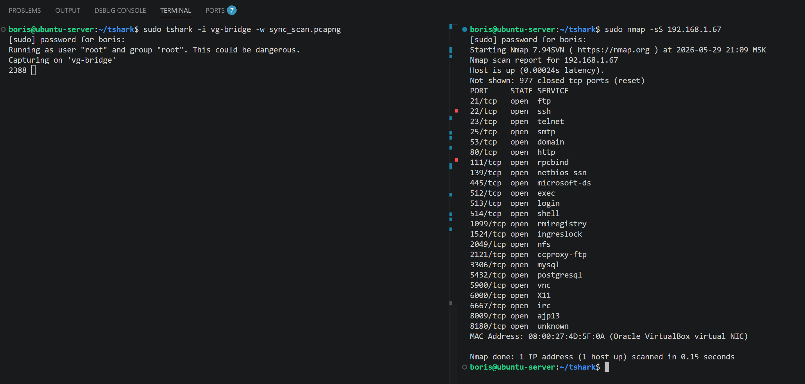

Переношу полученный файл и анализирую его в удобном графическом интерфейсе.

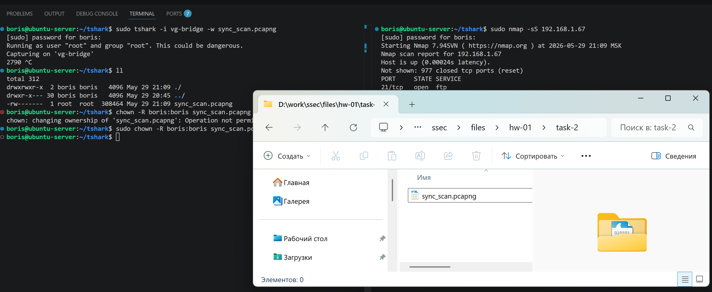

Запускаю **Wireshark** и анализирую файл.

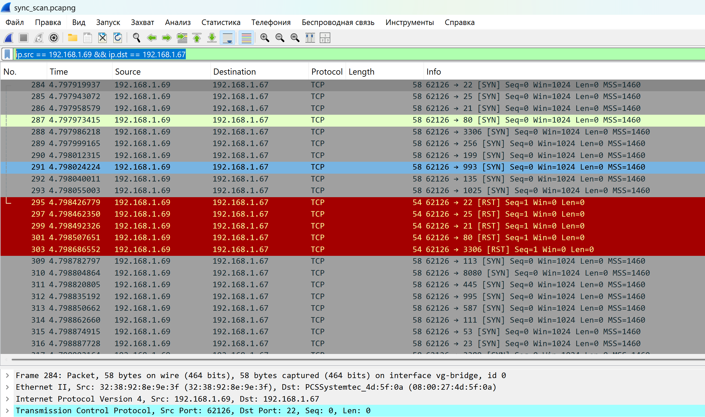

Я добавил фильтр `ip.src == 192.168.1.69 && ip.dst == 192.168.1.67`, чтобы посмотреть, какую информацию содержат пакеты при сканировании утилиты `nmap`.  
Сразу бросается в глаза, что при сканировании `nmap` в режиме **SYN** есть пакеты с содержанием в заголовках таких полей, как `[SYN]` и `[RST]`.

Теперь я посмотрю, какую информацию отправляет сканируемый хост (`192.168.1.67`), изменив фильтр на `ip.src == 192.168.1.67 && ip.dst == 192.168.1.69`:

    ip.src == 192.168.1.67 && ip.dst == 192.168.1.69

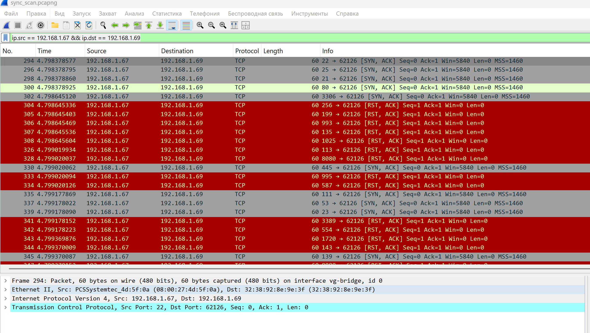

Тут я вижу, что сканируемый хост отправляет пакеты, в которых содержатся флаги `[SYN, ACK]` и `[RST, ACK]`.

Вспоминая основы протокола **TCP**, при установке **TCP**-соединения происходит так называемое тройное рукопожатие:

- **SYN** (Синхронизация)
- **SYN-ACK** (Синхронизация + Подтверждение)
- **ACK** (Подтверждение)

После чего **TCP**-соединение считается установленным. Значение флага `[RST]` говорит о том, что инициализируется сброс соединения.

Получается такая картина: сканирующий хост (`192.168.1.69`) отправляет пакеты с флагом `[SYN]`, сообщая хосту, что он хочет установить **TCP**-соединение. Сканируемый хост (`192.168.1.67`) отвечает на это пакетом с флагом `[SYN, ACK]`, говоря, что он принял пакет и готов к **TCP**-соединению. А вот дальше сканирующий хост не устанавливает соединение, а посылает пакет с флагом `[RST]` и аварийно завершает общение с сканируемым хостом, не устанавливая при этом **TCP**-соединение. Сканируемый хост отвечает на это пакетом с флагом `[RST, ACK]`. И так по всему диапазону портов или по тому диапазону, который может быть указан в утилите `nmap`.

На выходе я получаю информацию о том, какие порты открыты для установки **TCP**-соединения, причём как такового **TCP**-соединения не было.

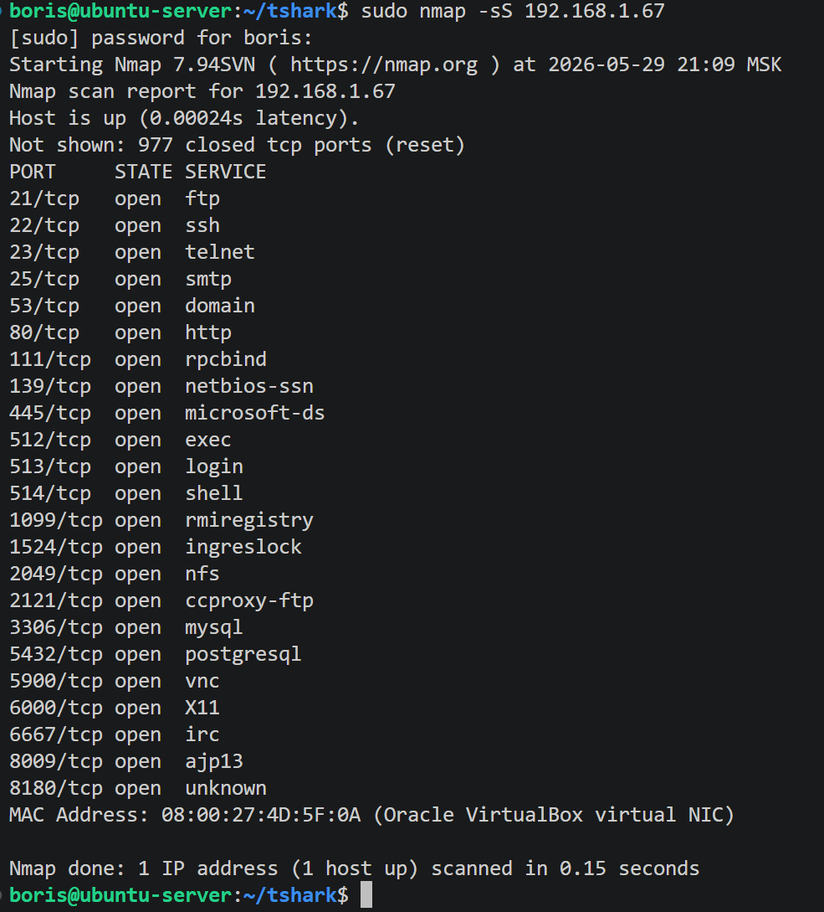

## FIN

Далее я делаю всё то же самое, только буду захватывать процесс сканирования с ключом `-sA`, то есть **FIN**-сканирование:

    sudo nmap -sA 192.168.1.67

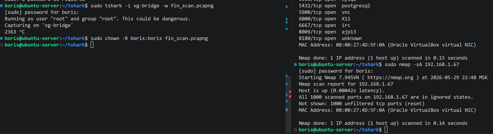

Открываю полученный файл в **Wireshark**.

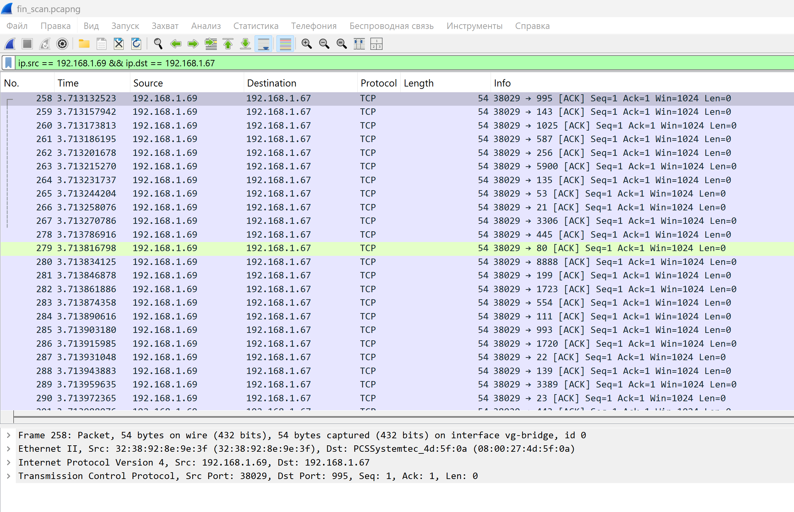

Тут я вижу, что сканирующий хост отправляет пакеты исключительно с содержанием флага `[ACK]` и всё. Посмотрю, как на это отвечает сканируемый хост.

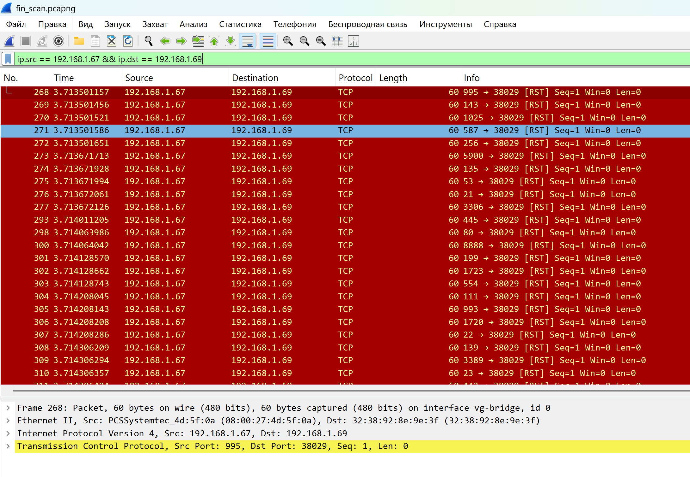

Сканируемый хост отвечает пакетами с содержанием флага `[RST]` – каких-либо других пакетов я не обнаружил.

Получается, что сканирующий хост посылает пакет `[ACK]`, то есть просто подтверждение получения данных, хотя по сути это вообще нелогично при установке **TCP**-соединения. Сканируемый хост на это отвечает адекватным `[RST]`, так как соединения нет – это вполне адекватное поведение, то есть сканируемый хост аварийно сбрасывает соединение.

По завершению работы `nmap` в таком режиме я получаю следующий результат.

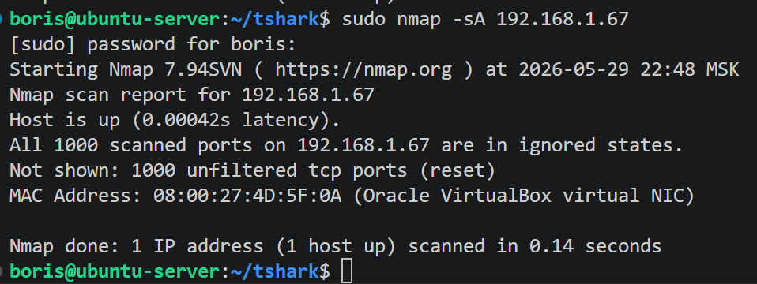

Могу предположить, что цель такого сканирования – проверка сетевого экрана или каких-либо фильтров, а не наличия открытых портов как таковых.

## Xmas

Следующим режимом будет **Xmas**. Для этого запускаю `nmap` с ключом `-sX`:

    sudo nmap -sX 192.168.1.67

Перехожу сразу к анализу пакетов в **Wireshark**.

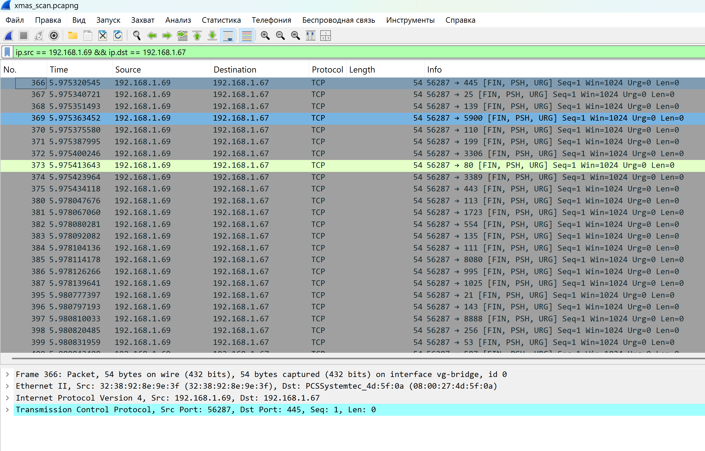

Вижу, что сканирующий хост отправляет пакеты с флагами `[FIN, PSH, URG]`. Вообще флаг **FIN** сигнализирует о завершении **TCP**-соединения, флаг **PSH** говорит о немедленной передаче данных приложению (не буферизировать), а флаг **URG** сообщает о срочности данных.

Посмотрю, как на это реагирует сканируемый хост.

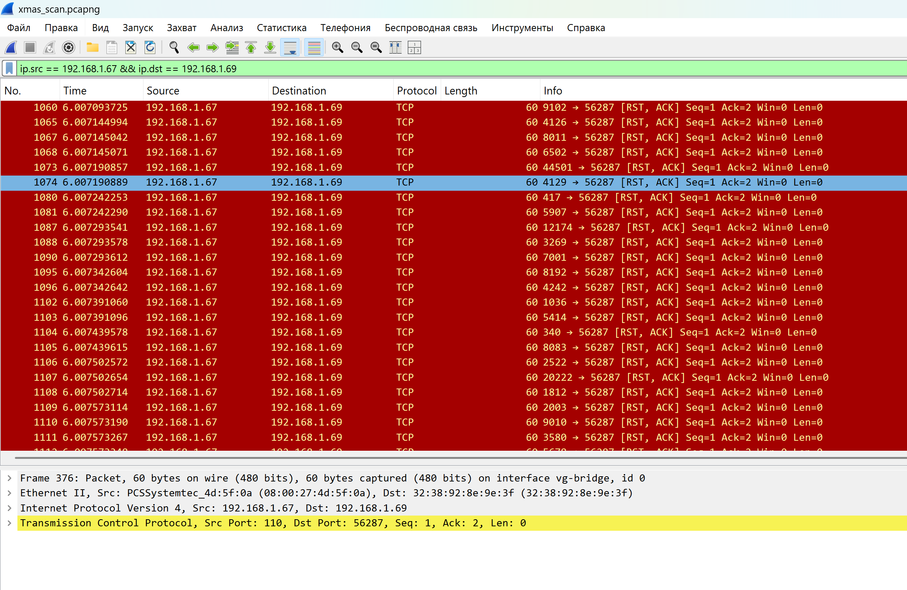

Тут я вижу, что сканируемый хост отвечает пакетами с флагом `[RST, ACK]`, то есть хост подтверждает, что получил пакет, и тут же инициализирует сброс соединения.

Получается ситуация, похожая на случай с **FIN**, только такое сканирование усиливается дополнительными флагами **PSH**, **URG**, которые кричат о важности и срочности. Думаю, это разновидность сканирования для выявления каких-либо фильтров, если другие методы не дают результата.

## UDP

И последний метод – скан по **UDP** протоколу. `nmap` в таком режиме запускается с ключом `-sU`:

    sudo nmap -sU 192.168.1.67

В процессе сканирования я выявил, что такой метод занимает весьма долгое время, если сканировать по всему диапазону портов. Поэтому я буду сканировать небольшой диапазон, к примеру с 22 порта по 100:

    sudo nmap -sU 192.168.1.67 -p22-100

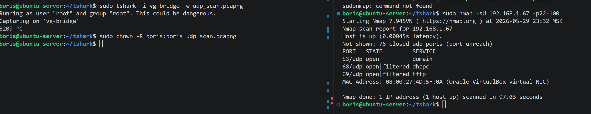

Анализирую трафик по протоколу **UDP**.

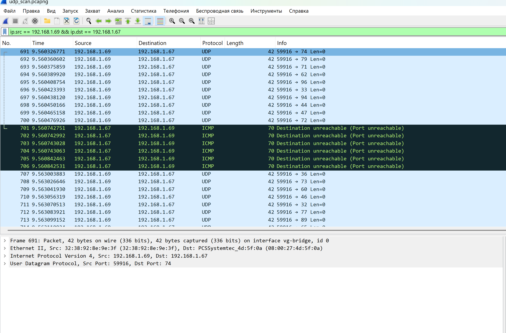

Тут я вижу только информацию о том, что пакет был отправлен по протоколу **UDP**, а также вижу, что ответ приходит по протоколу **ICMP** от сканируемого хоста. Это я могу увидеть детально, поменяв фильтр.

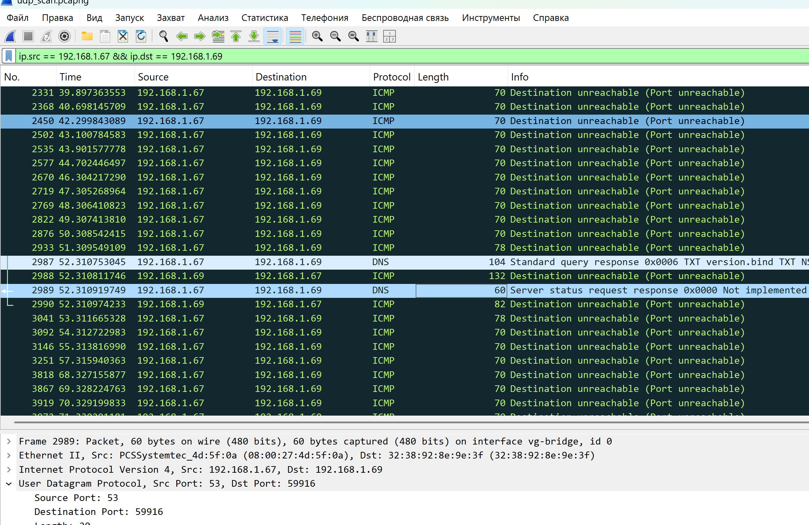

Вот тут наглядно видно, что когда приходит запрос по протоколу **UDP** и в случае, если порт не открыт по данному протоколу, то ответ направляется по протоколу **ICMP**. Тут я вижу, что порт **53**, на котором работает **DNS**-служба, отвечает хосту именно по этому протоколу.

Вообще протокол **UDP** работает без гарантии доставки данных, и получается: если порт закрыт по **UDP**, то мы получим сообщение по **ICMP** о том, что порт недоступен; а если порт открыт, то можем вообще ничего не получить либо получить информацию от сервиса, который работает по данному протоколу на данном порту.

---
---