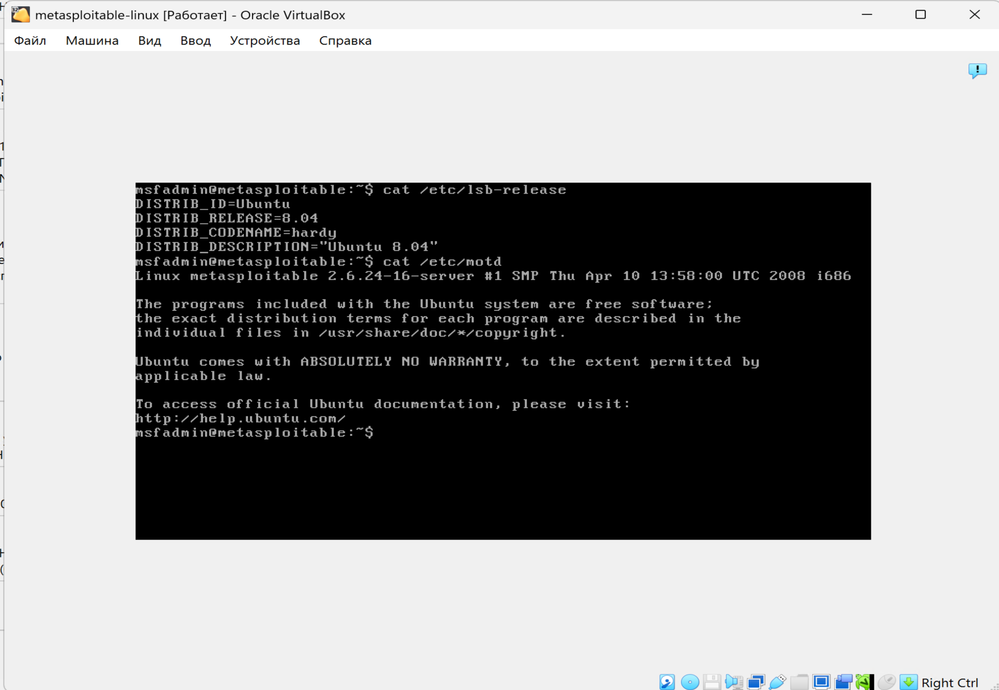
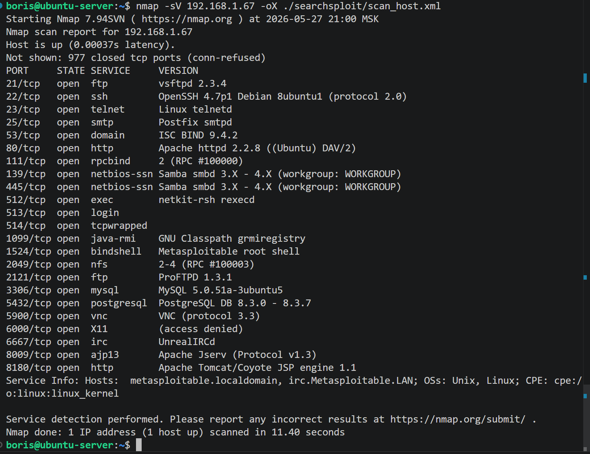
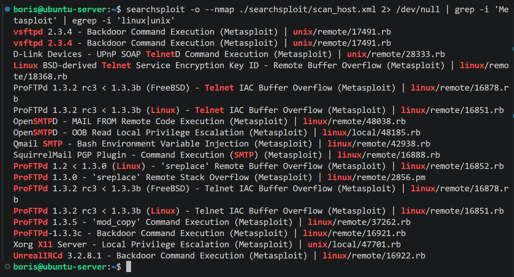
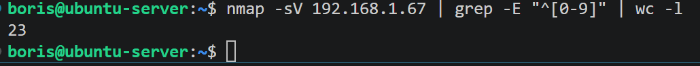
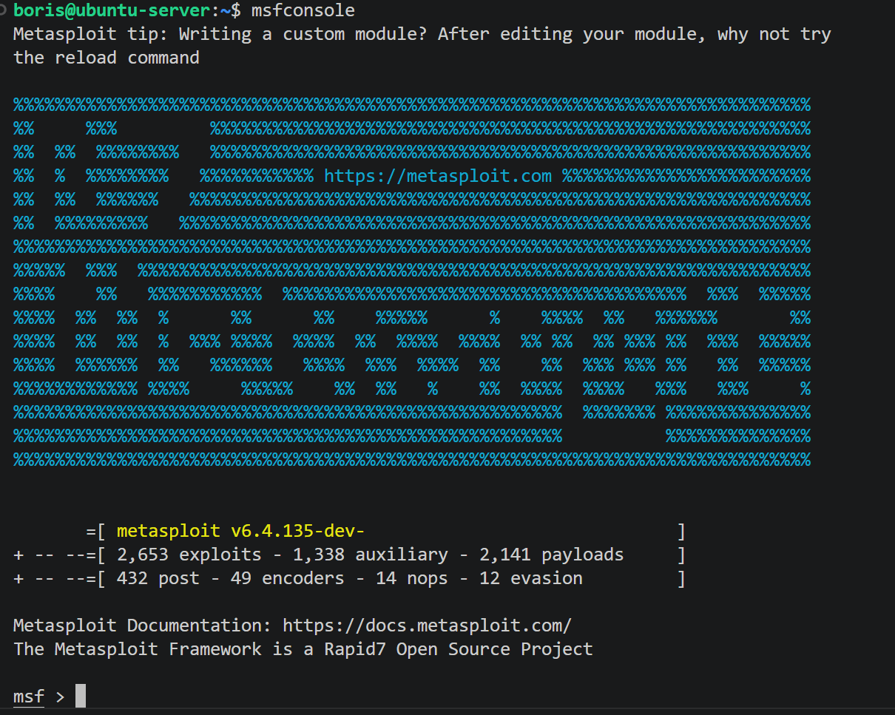
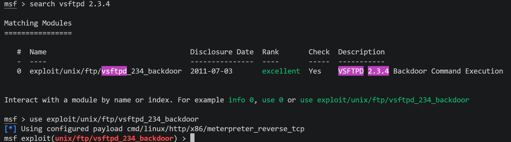
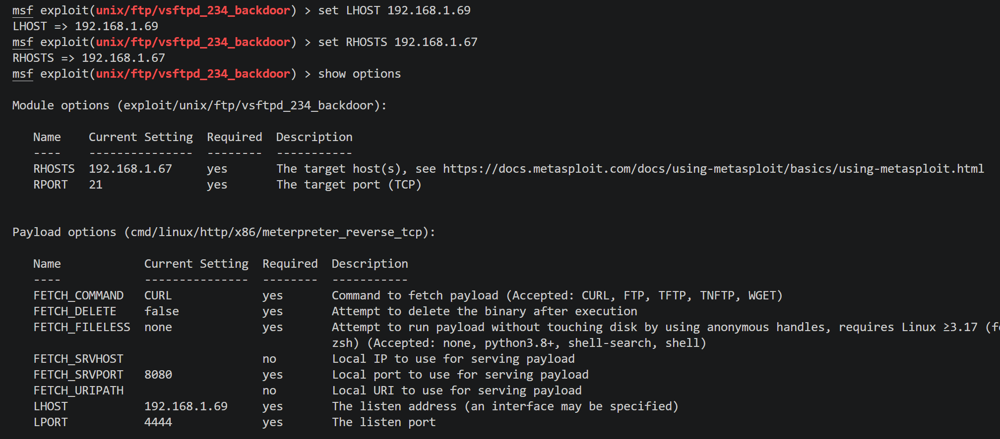
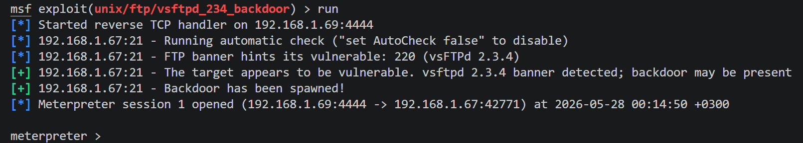
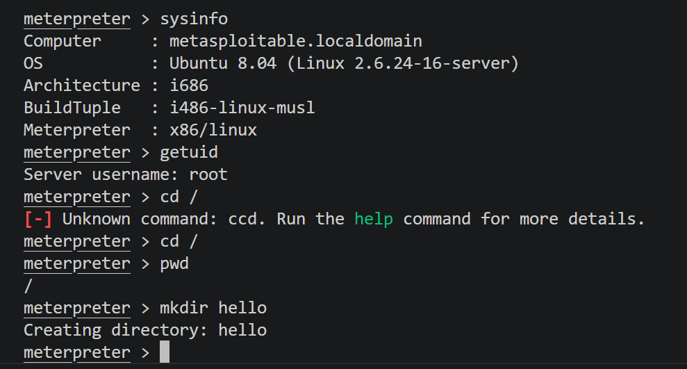
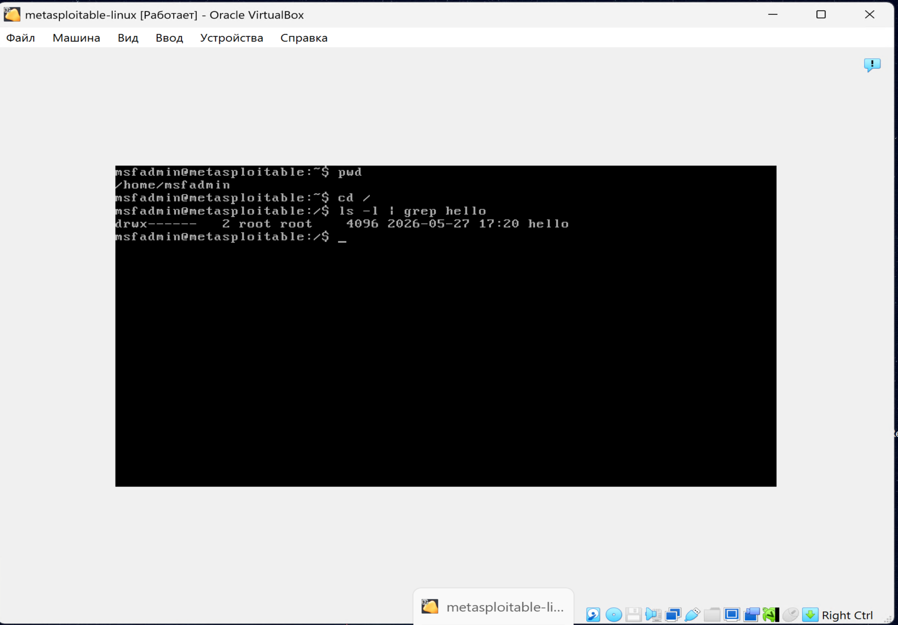

# Домашнее задание к занятию "`Уязвимости и атаки на информационные системы`" - `Сидоров Борис`

---
---

## Задание 1

Скачайте и установите виртуальную машину Metasploitable: https://sourceforge.net/projects/metasploitable/.

Это типовая ОС для экспериментов в области информационной безопасности, с которой следует начать при анализе уязвимостей.

Просканируйте эту виртуальную машину, используя **nmap**.

Попробуйте найти уязвимости, которым подвержена эта виртуальная машина.

Сами уязвимости можно поискать на сайте https://www.exploit-db.com/.

Для этого нужно в поиске ввести название сетевой службы, обнаруженной на атакуемой машине, и выбрать подходящие по версии уязвимости.

Ответьте на следующие вопросы:

- Какие сетевые службы в ней разрешены?
- Какие уязвимости были вами обнаружены? (список со ссылками: достаточно трёх уязвимостей)
  
*Приведите ответ в свободной форме.* 

---

## Решение 1
Первым делом приступил к скачиванию готовой **`VM`** в формате дискового устройства и запустил её в гипервизоре **`VirtualBOX`**.

Далее я подготовил свой основной тестовый стенд под управлением **`OS Ubuntu`**, установив на него фреймворк **`Metasploit`**, а также утилиту **`searchsploit`** для поиска уязвимостей сетевых служб, которые я обнаружу в процессе сканирования утилитой **`nmap`**.

Затем со своей лабораторной машины просканировал данную **`VM`**, использовав команду:

    nmap -sV 192.168.1.67 -oX ./searchsploit/scan_host.xml

Изначально я искал уязвимости вручную, вводя наименования сетевой службы в базу **`searchsploit`**, но в **`man`** обнаружил возможность чтения файла **`.xml`** с помощью ключа **`--nmap`** – это позволяет прочитать полученный файл, созданный утилитой **`nmap`**.

Итак, запускаю **`nmap`** и сканирую **`VM`** **`Metasploit`**.

А теперь запускаю **`searchsploit`**, используя полученный файл, также вывод прогоняю через несколько команд **`grep`**. Я хочу получить в выводе уязвимости с пометкой **`(Metasploit)`**, то есть те уязвимости, по которым уже есть существующие модули во фреймворке **`Metasploit`**. Также меня интересуют уязвимости, связанные только с **`linux`**, поэтому добавлю ещё один **`grep`** по слову **`linux`** или **`unix`**. Получается такая команда:

    searchsploit -o --nmap ./searchsploit/scan_host.xml 2> /dev/null | grep -i 'Metasploit' | egrep -i 'linux|unix'

Вот что получилось в итоге.

Что имеем по итогу: один только **`nmap`** показал, что на хосте есть **23** открытых **`tcp`** порта, на которых работают различные сервисы, что уже даёт большой диапазон для осуществления атак. На хосте запущены такие сетевые службы, как **`ftp`** на портах **21|2121**, **`ssh`** на порту **22**, **`smtp`** на порту **25**, **`http`** на портах **80|8180**, **`postgresql`** на порту **5432** – то, что сразу бросается в глаза.

Даже в таком грубом фильтре с **`grep`** по **`Metasploit`** я вижу несколько критичных уязвимостей, например:

- **`vsftpd 2.3.4 - Backdoor Command Execution (Metasploit)`**
- **`UnrealIRCd 3.2.8.1 - Backdoor Command Execution (Metasploit)`**

Касательно **`vsftpd`** – даже версия подходит, и можно попробовать провести атаку с уже существующим модулем в **`Metasploit`**. Попробую это сделать.

Запускаю консоль **`Metasploit`**.

Далее нахожу модуль для найденной уязвимости и подгружаю его.

Смотрю опции модуля и корректирую настройки исходя из требований модуля.

Всё готово, пробую осуществить атаку с **`payload`** по умолчанию, даже не меняя ничего.

Получилось! Я завладел **`shell`** целевого хоста и могу выполнять на нём различные команды. Проверю версию **`OS`** и под какой **`УЗ`** я работаю.

Я завладел **`shell`** под **`УЗ root`** и, таким образом, получил полный контроль над системой. Создал в корневой директории директорию **`hello`**. Могу проверить на **`VM`**, так ли это.

Да, действительно, директория появилась.

Я попробовал по такому же сценарию уязвимость **`UnrealIRCd 3.2.8.1 - Backdoor Command Execution (Metasploit)`** – она тоже сработала.

---
---

