# Домашнее задание к занятию "`Защита хоста`" - `Сидоров Борис`

---
---

### Задание 1

1. Установите **eCryptfs**.
2. Добавьте пользователя cryptouser.
3. Зашифруйте домашний каталог пользователя с помощью eCryptfs.

*В качестве ответа  пришлите снимки экрана домашнего каталога пользователя с исходными и зашифрованными данными.*  

---
## Решение 1
Как я понял, пакет **`ecryptfs-utils`** позволяет осуществить шифрование данных на уже созданной файловой системе, что упрощает его использование в отличие от утилиты **`LUKS`**, где шифрование осуществляется на более низком уровне – непосредственно с секторами блочного устройства.

У каждого подхода есть свои плюсы и минусы. **`eCryptfs`** более гибкий в использовании, но медленнее при работе с данными, так как шифрование происходит на лету через дополнительный слой абстракции. **`LUKS`** же, в свою очередь, шифрует непосредственно блоки устройства и работает быстрее, но при этом в основном необходимо шифровать полностью весь раздел блочного устройства или же полностью весь диск.

Итак, начну выполнять задание по утилите **`eCryptfs`**.

Установил пакет из стандартного репозитория Ubuntu через обычный **`apt install`**. Вот какая версия доступна на текущий момент из стандартного репозитория:

Теперь я создам нового пользователя, и у этого пользователя будет зашифрована домашняя директория. Выполняю команду:

    sudo adduser --encrypt-home new_user

Я создал нового пользователя с дополнительным ключом **`--encrypt-home`**, который позволяет зашифровать домашнюю директорию. Самое главное, что пароль для дешифровки данных будет выступать в качестве его собственного пароля. Возможность автоматического монтирования и размонтирования домашней директории достигается модулем **`PAM`**.

Далее я переключусь на нового пользователя и создам какой-нибудь файл.

    su - new_user
    echo "secret data" > secret.txt

Я создал файл с текстом внутри. Теперь попробую посмотреть содержимое данной директории в другой терминальной сессии из-под **`root`**.

Пока новый пользователь залогинен, я могу видеть его директорию и содержимое. Теперь разлогинюсь из-под нового пользователя:

И проверю, смогу ли я из-под **`root`** получить доступ к домашней директории нового пользователя:

Вижу, что даже из-под **`root`** я не могу получить доступ к зашифрованной директории.

Можно зашифровать абсолютно любые директории в системе, не только домашние, только это делается уже сложнее и потребует генерации кодовой фразы.

Создаю директорию, в которой будет шифроваться информация:

    mkdir .encrypted_testdir

Создаю директорию для точки монтирования зашифрованной директории:

    mkdir decrypted_testdir

Создаю кодовую фразу для связки ключей ядра (фразу нужно запомнить):

    ecryptfs-add-passphrase

После этого программа выдает полученную сигнатуру моего ключа. Данную сигнатуру лучше записать, так как при расшифровке директории программа выведет сигнатуру ключа, и если она не совпадет с той, что я получил сейчас, дешифровка данных не будет выполнена. Эта сигнатура – способ убедиться, что ключ корректный, и гарантирует, что данные будут расшифрованы.

Далее монтирую директорию **`.encrypted_testdir`** в точку монтирования **`decrypted_testdir`**. Для программы **`mount`** использую ключи **`-t`** (тип) и выбираю специальную файловую систему **`ecryptfs`**:

    mount -t ecryptfs /home/vm01/.encrypted_testdir/ /home/vm01/decrypted_testdir/

Далее программа будет интерактивно спрашивать, как производить шифрование. Сначала выбираю метод через кодовое слово, которое ввел ранее – цифра **1**, и ввожу кодовое слово.

.png)

Затем спрашивают, какой метод шифрования выбрать. Выбираю самый современный **`aes`** – цифра **1**.

Далее просят выбрать количество байт ключа. Выбираю самое длинное – цифра **2**.

Теперь спрашивают, будет ли возможность хранить файлы, которые не будут шифроваться, вместе с зашифрованными файлами. Следуя лучшим практикам, выбираю **`no`**.

Теперь спрашивают, шифровать ли имена файлов. Тут можно выбрать что угодно, но раз уж я начал шифровать директорию, то буду делать это полностью, в том числе имена файлов и директорий будут тоже зашифрованы. Выбираю **`yes`**.

Теперь сверяю сигнатуру ключа. Если совпадает, значит кодовое слово на первом шаге было введено верно. Нажимаю просто **`Enter`**.

Предупреждают, что ранее данный ключ не использовался, и спрашивают, продолжать ли процесс монтирования. Соглашаюсь – **`yes`**.

Спрашивают, сохранить ли сигнатуру в файл кеша, чтобы в будущем не спрашивать всё заново при последующем монтировании зашифрованной директории. Соглашаюсь – **`yes`**.

Файл сигнатуры был записан, но монтирование не было выполнено, так как забыл выполнить команду с повышением привилегий **`sudo`**. 

Повторяю всю процедуру монтирования ещё раз, но уже с правами **`root`**.

Теперь точка монтирования создана, и можно скопировать какие-нибудь данные в точку монтирования – они будут впоследствии зашифрованы.

Теперь размонтирую директорию, после чего ещё раз попробую выполнить **`ls`**:

Вижу, что теперь директория пуста. А что же находится в директории, которая была примонтирована – **`.encrypted_testdir`**?

Вижу, что файл есть, но название вместо **`go1.25.1.linux-amd64.tar.gz`** теперь содержит какую-то абракадабру. И теперь любой пользователь, даже **`root`** или злоумышленник, получивший доступ к физическому устройству, увидит именно это и без ключа не сможет расшифровать данные.

Дальше зашифрованную директорию можно также скопировать по сети и примонтировать к любой другой системе, главное – правильно выбрать параметры шифрования, которые были указаны ранее, и, само собой, верно ввести кодовую фразу.

---
---

### Задание 2

1. Установите поддержку **LUKS**.
2. Создайте небольшой раздел, например, 100 Мб.
3. Зашифруйте созданный раздел с помощью LUKS.

*В качестве ответа пришлите снимки экрана с поэтапным выполнением задания.*

---
## Решение 2
Так как утилита **LUKS** работает на более низком уровне в отличие от **eCryptfs**, я сперва создам виртуальный диск небольшого размера для **VM**.

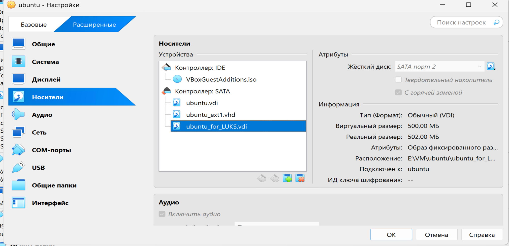

Проверяю, появилось ли новое устройство в системе:

    lsblk -p -o +FSTYPE | grep -v loop

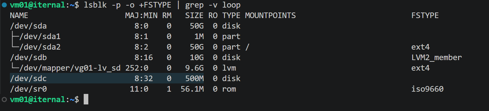

Да, я вижу, что новое устройство с меткой **sdc** появилось, размером **500M**, и теперь можно с ним работать.

Подготовлю новый зашифрованный раздел, используя утилиту **cryptsetup**:

    sudo cryptsetup luksFormat -y -v --type luks2 /dev/sdc

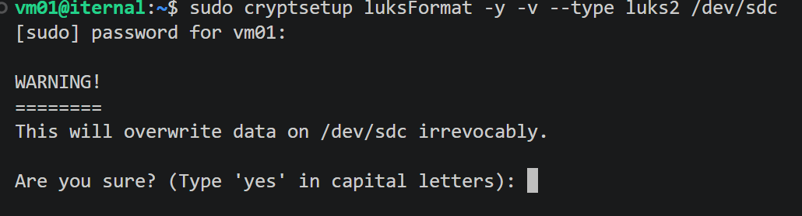

Вижу предупреждение, что будут перезаписаны все данные на указанном устройстве. Соглашаюсь, введя большими буквами **YES**.

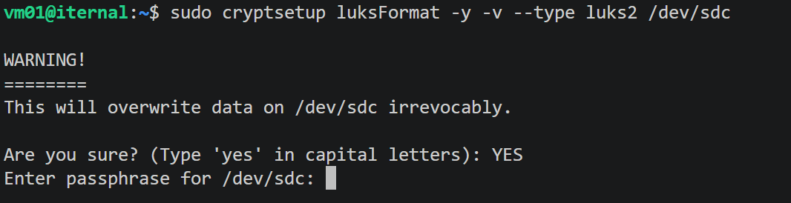

Далее предлагается придумать кодовую фразу, которая будет выступать ключом для дешифровки данных в будущем. Фразу нужно запомнить.

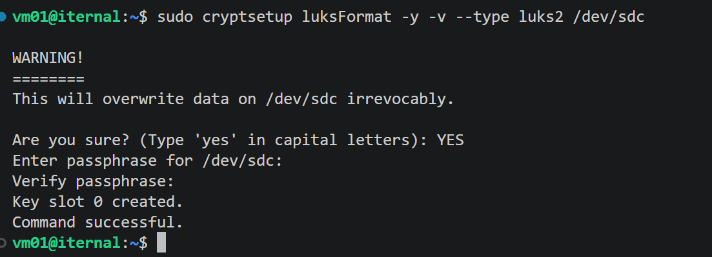

Готово. Посмотрю, что получилось, и выведу ещё раз **lsblk**:

    lsblk

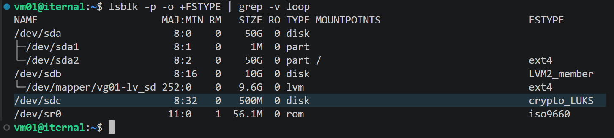

Вижу, что на устройстве **/dev/sdc** появилась файловая система **crypto_LUKS**.

Далее расшифровываем устройство, введя кодовую фразу, придуманную ранее, а также задаём имя устройства в конце команды:

    sudo cryptsetup open /dev/sdc secker_disk

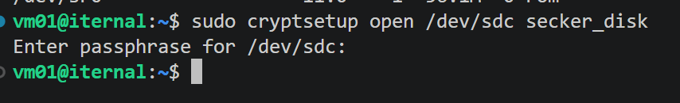

Смотрю ещё раз список блочных устройств:

    lsblk

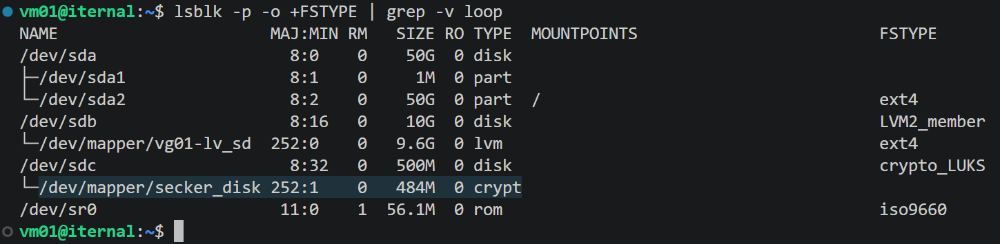

Вижу, что подсистема ядра создала новое блочное устройство **secker_disk**, и оно располагается в директории **/dev/mapper/**. Как я понял, в эту директорию попадают созданные подсистемой ядра **Device Mapper** виртуальные устройства из сырых блочных устройств.

Далее с полученным виртуальным блочным устройством можно работать как с обычным. Сначала отформатирую его на низком уровне, используя утилиту **dd**, заполнив все данные на устройстве нулями. Выполню команду:

    sudo dd if=/dev/zero of=/dev/mapper/secker_disk

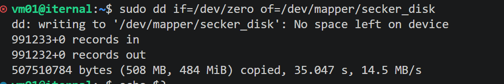

Несмотря на то, что программа завершила работу с кодом возврата **1**, в данном случае это связано с тем, что не осталось места на диске и нечем заполнять нулями. То есть форматирование было выполнено успешно.

Далее можно приступать к созданию файловой системы на данном виртуальном блочном устройстве:

    sudo mkfs.ext4 /dev/mapper/secker_disk

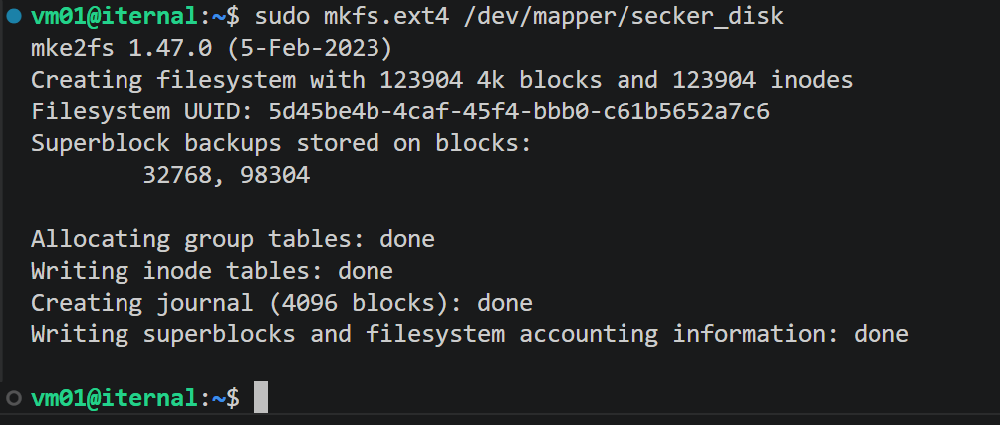

Проверяю результат **lsblk**.

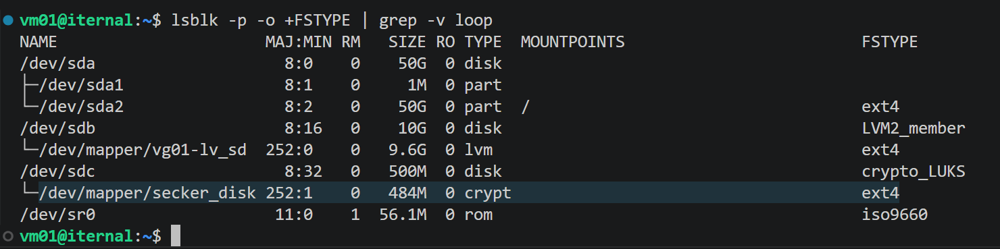

Теперь устройство готово к монтированию для работы с ним. Создам скрытую директорию, которая будет выступать как точка монтирования:

    mkdir ./.secret_info

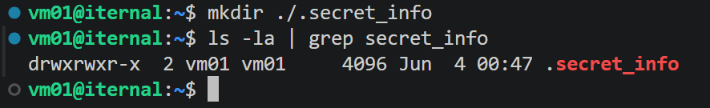

Далее монтирую виртуальное блочное устройство:

    sudo mount /dev/mapper/secker_disk ./.secret_info/

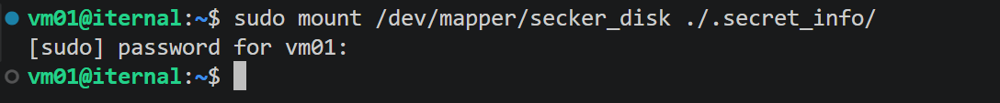

Проверю, появилась ли точка монтирования.

.png)

Вижу, что точка монтирования появилась.

Теперь я могу работать с директорией **.secret_info**, создавая или копируя файлы. Все данные шифруются, и после размонтирования без ключа считать их не получится. Если требуется предоставить доступ не только администратору системы, то нужно будет также изменить права для директории **.secret_info**.

Скопирую несколько файлов:

    sudo cp *_ps ./.secret_info/

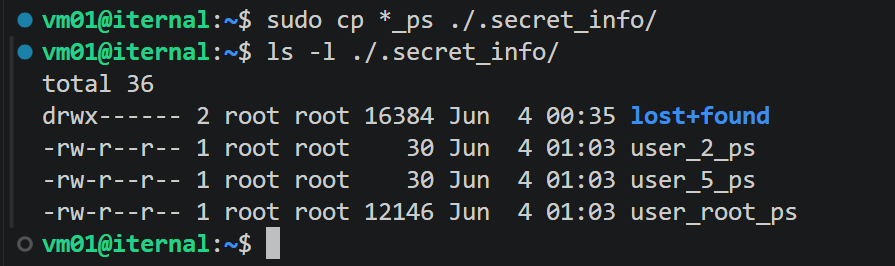

После завершения работы размонтирую устройство. Для более точной команды использую абсолютный путь:

    sudo umount /home/vm01/.secret_info

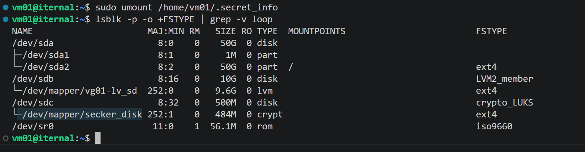

Вижу, что точка монтирования пропала.

Осталось закрыть отображение виртуального устройства в системе:

    sudo cryptsetup close /dev/mapper/secker_disk

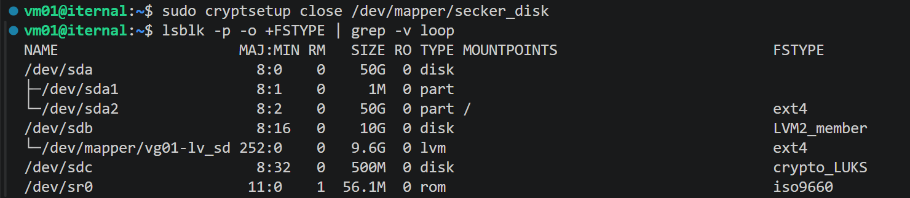

Всё, теперь виртуальное устройство пропало из системы, и по сути можно физически отключить накопитель и переподключить к другому серверу, используя его там.

.png)

Отключил.

---

Теперь я запущу другую **VM** и там подключу этот накопитель.

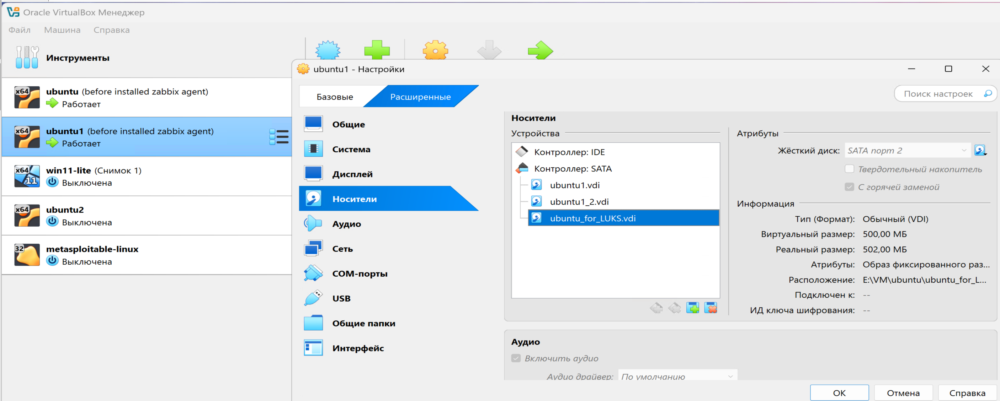

Подключаюсь по **ssh** к **VM02** и проверю блочные устройства:

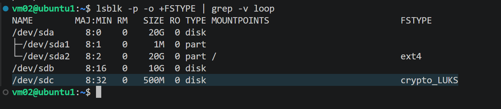

Вижу, что устройство появилось. Ориентируюсь не на название **sdc**, а на размер и тип файловой системы.

Далее проделываю всё то же самое: создаю виртуальное файловое устройство через **sudo cryptsetup open**, ввожу ключ, создаю точку монтирования и монтирую полученное виртуальное блочное устройство.

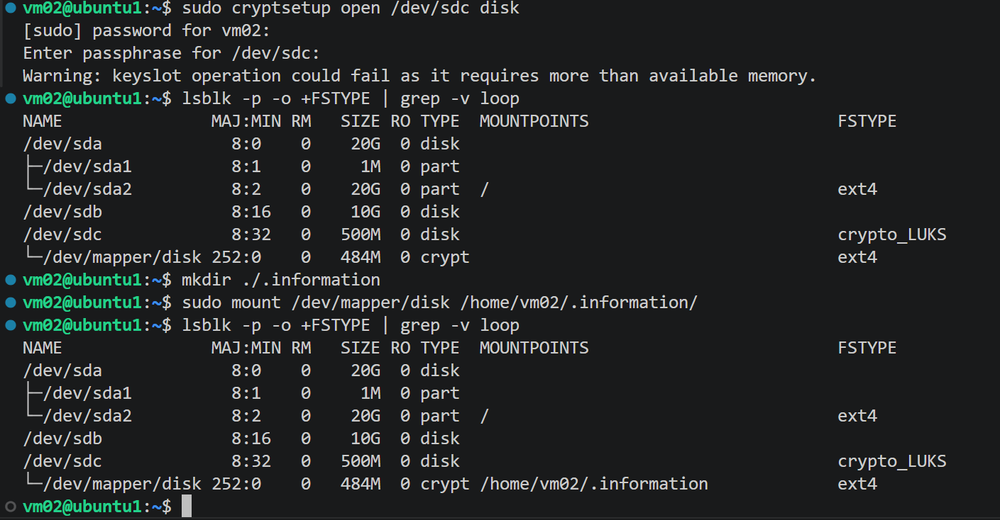

Готово. Теперь проверю содержимое:

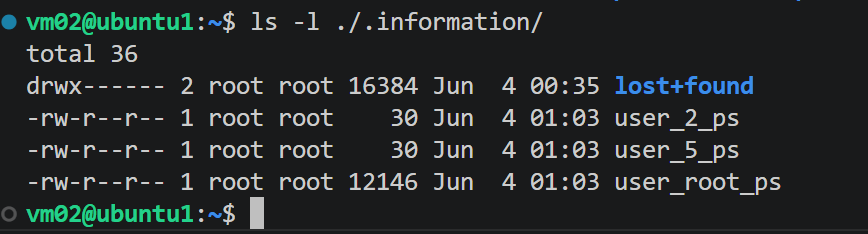

Вижу, что данные успешно прочитаны. Дальше можно продолжать работу с зашифрованным устройством.

---
---

