# Домашнее задание к занятию "`Защита хоста`" - `Сидоров Борис`

---
---

### Задание 1

1. Установите **eCryptfs**.
2. Добавьте пользователя cryptouser.
3. Зашифруйте домашний каталог пользователя с помощью eCryptfs.

*В качестве ответа  пришлите снимки экрана домашнего каталога пользователя с исходными и зашифрованными данными.*  

---
## Решение 1
Как я понял, пакет **`ecryptfs-utils`** позволяет осуществить шифрование данных на уже созданной файловой системе, что упрощает его использование в отличие от утилиты **`LUKS`**, где шифрование осуществляется на более низком уровне – непосредственно с секторами блочного устройства.

У каждого подхода есть свои плюсы и минусы. **`eCryptfs`** более гибкий в использовании, но медленнее при работе с данными, так как шифрование происходит на лету через дополнительный слой абстракции. **`LUKS`** же, в свою очередь, шифрует непосредственно блоки устройства и работает быстрее, но при этом в основном необходимо шифровать полностью весь раздел блочного устройства или же полностью весь диск.

Итак, начну выполнять задание по утилите **`eCryptfs`**.

Установил пакет из стандартного репозитория Ubuntu через обычный **`apt install`**. Вот какая версия доступна на текущий момент из стандартного репозитория:

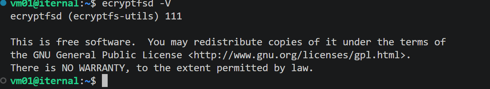

Теперь я создам нового пользователя, и у этого пользователя будет зашифрована домашняя директория. Выполняю команду:

    sudo adduser --encrypt-home new_user

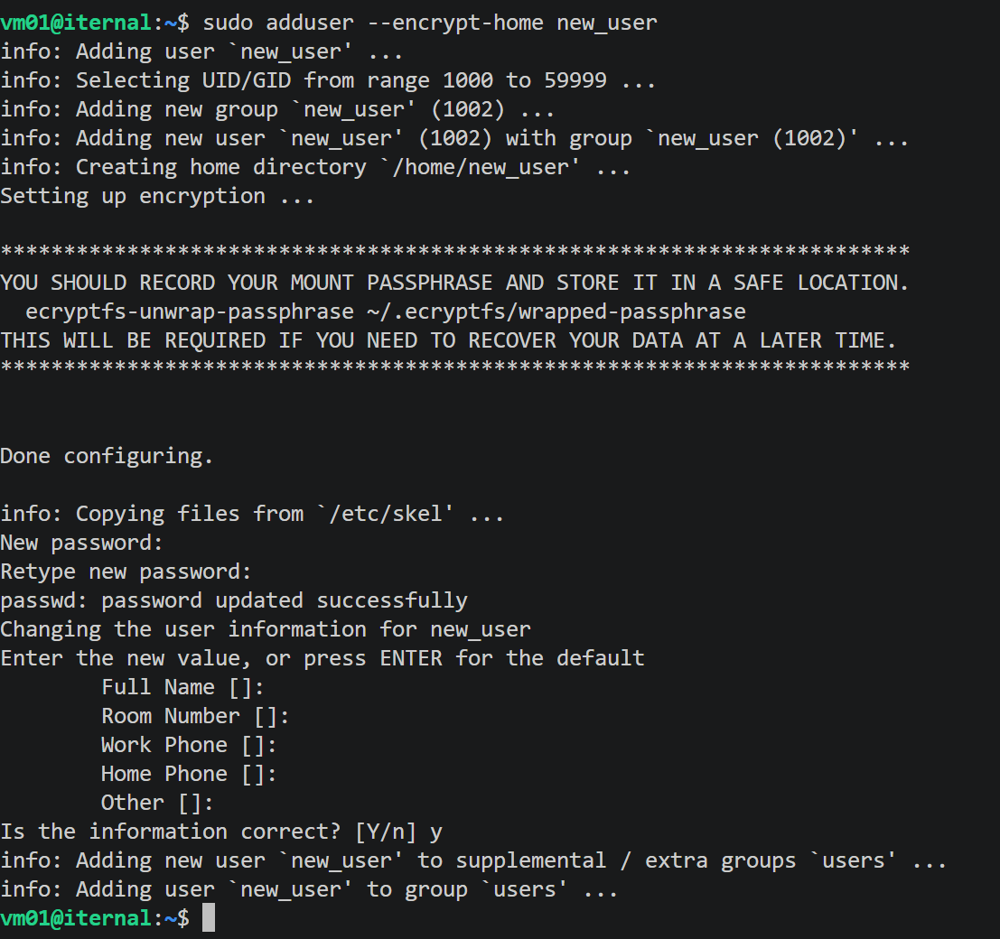

Я создал нового пользователя с дополнительным ключом **`--encrypt-home`**, который позволяет зашифровать домашнюю директорию. Самое главное, что пароль для дешифровки данных будет выступать в качестве его собственного пароля. Возможность автоматического монтирования и размонтирования домашней директории достигается модулем **`PAM`**.

Далее я переключусь на нового пользователя и создам какой-нибудь файл.

    su - new_user
    echo "secret data" > secret.txt

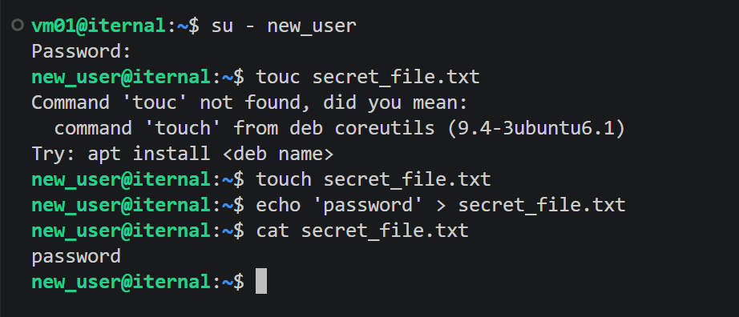

Я создал файл с текстом внутри. Теперь попробую посмотреть содержимое данной директории в другой терминальной сессии из-под **`root`**.

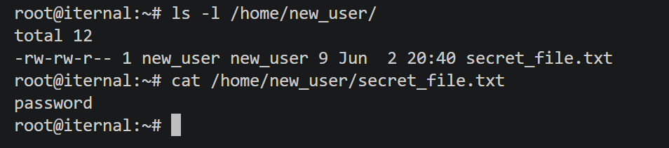

Пока новый пользователь залогинен, я могу видеть его директорию и содержимое. Теперь разлогинюсь из-под нового пользователя:

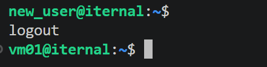

И проверю, смогу ли я из-под **`root`** получить доступ к домашней директории нового пользователя:

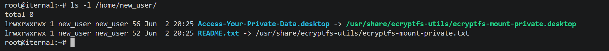

Вижу, что даже из-под **`root`** я не могу получить доступ к зашифрованной директории.

Можно зашифровать абсолютно любые директории в системе, не только домашние, только это делается уже сложнее и потребует генерации кодовой фразы.

Создаю директорию, в которой будет шифроваться информация:

    mkdir .encrypted_testdir

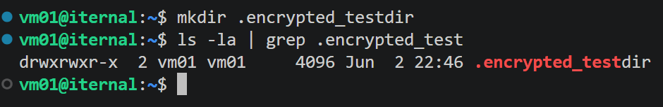

Создаю директорию для точки монтирования зашифрованной директории:

    mkdir decrypted_testdir

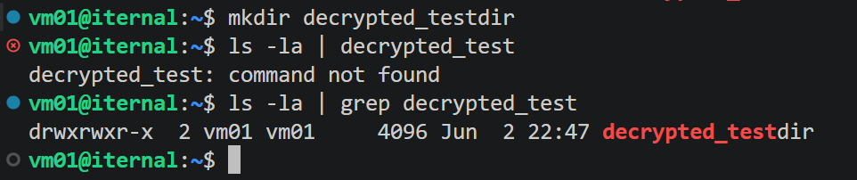

Создаю кодовую фразу для связки ключей ядра (фразу нужно запомнить):

    ecryptfs-add-passphrase

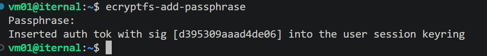

После этого программа выдает полученную сигнатуру моего ключа. Данную сигнатуру лучше записать, так как при расшифровке директории программа выведет сигнатуру ключа, и если она не совпадет с той, что я получил сейчас, дешифровка данных не будет выполнена. Эта сигнатура – способ убедиться, что ключ корректный, и гарантирует, что данные будут расшифрованы.

Далее монтирую директорию **`.encrypted_testdir`** в точку монтирования **`decrypted_testdir`**. Для программы **`mount`** использую ключи **`-t`** (тип) и выбираю специальную файловую систему **`ecryptfs`**:

    mount -t ecryptfs /home/vm01/.encrypted_testdir/ /home/vm01/decrypted_testdir/

Далее программа будет интерактивно спрашивать, как производить шифрование. Сначала выбираю метод через кодовое слово, которое ввел ранее – цифра **1**, и ввожу кодовое слово.

.png)

Затем спрашивают, какой метод шифрования выбрать. Выбираю самый современный **`aes`** – цифра **1**.

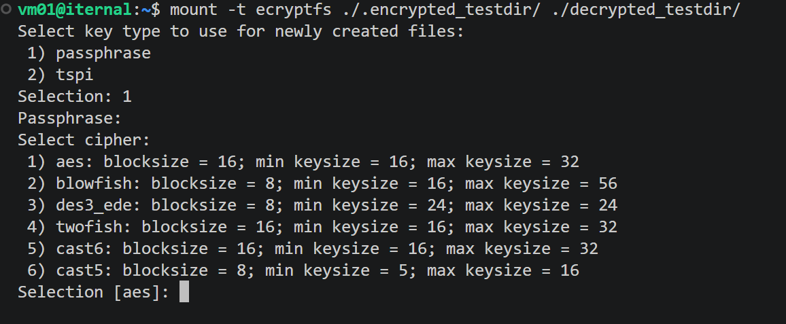

Далее просят выбрать количество байт ключа. Выбираю самое длинное – цифра **2**.

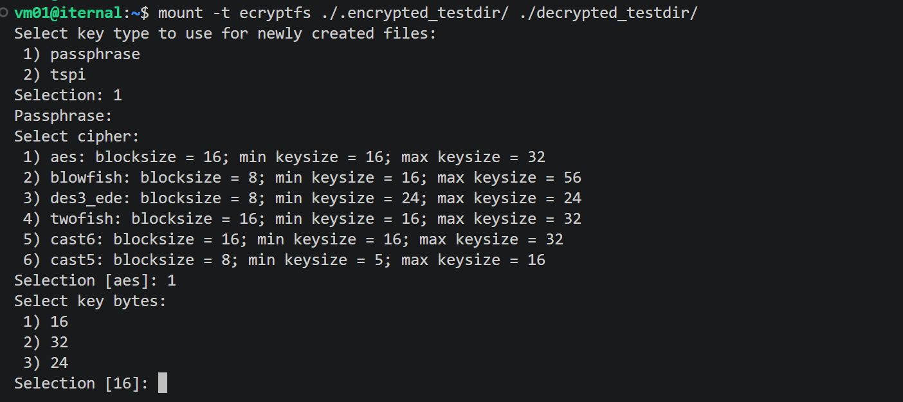

Теперь спрашивают, будет ли возможность хранить файлы, которые не будут шифроваться, вместе с зашифрованными файлами. Следуя лучшим практикам, выбираю **`no`**.

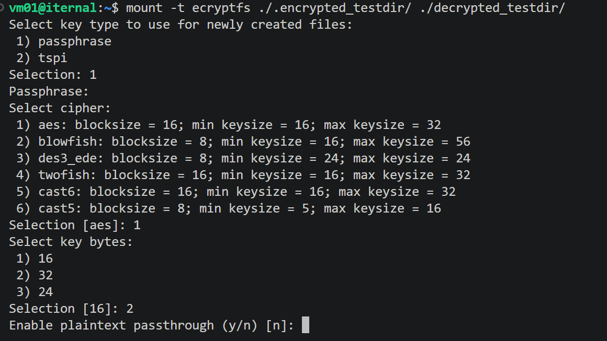

Теперь спрашивают, шифровать ли имена файлов. Тут можно выбрать что угодно, но раз уж я начал шифровать директорию, то буду делать это полностью, в том числе имена файлов и директорий будут тоже зашифрованы. Выбираю **`yes`**.

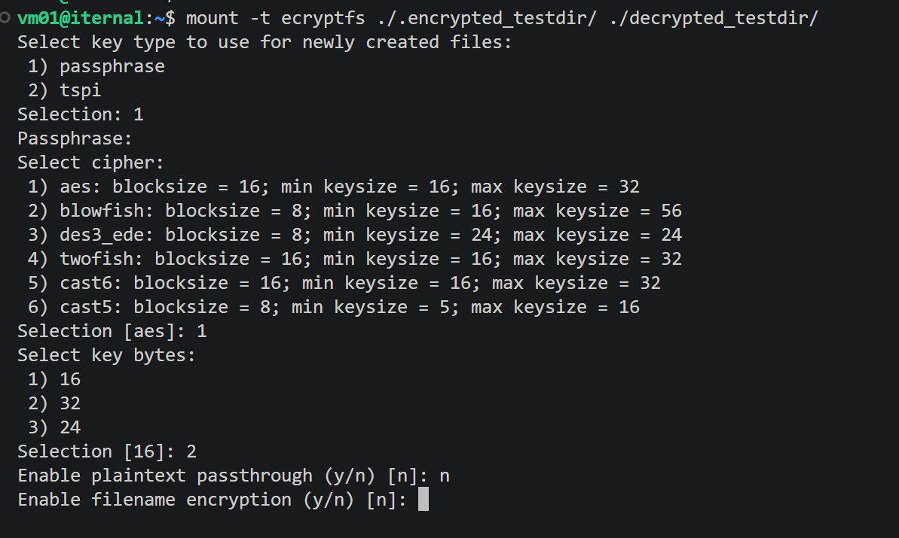

Теперь сверяю сигнатуру ключа. Если совпадает, значит кодовое слово на первом шаге было введено верно. Нажимаю просто **`Enter`**.

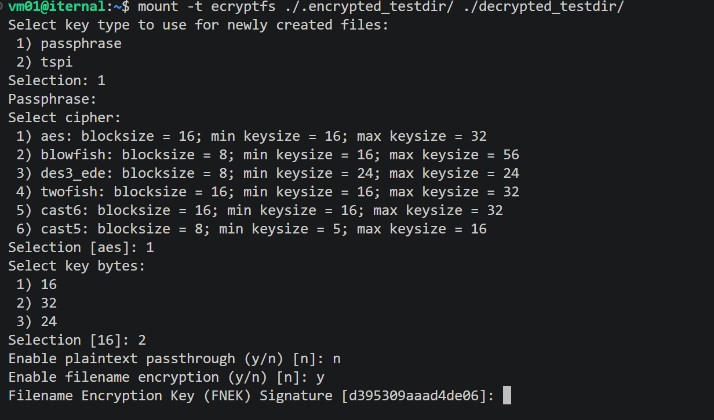

Предупреждают, что ранее данный ключ не использовался, и спрашивают, продолжать ли процесс монтирования. Соглашаюсь – **`yes`**.

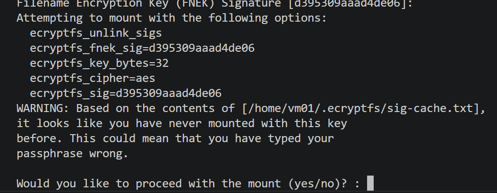

Спрашивают, сохранить ли сигнатуру в файл кеша, чтобы в будущем не спрашивать всё заново при последующем монтировании зашифрованной директории. Соглашаюсь – **`yes`**.

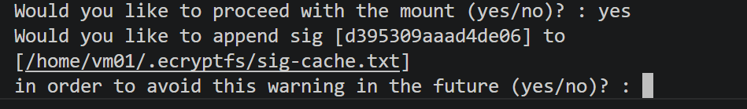

Файл сигнатуры был записан, но монтирование не было выполнено, так как забыл выполнить команду с повышением привилегий **`sudo`**. 

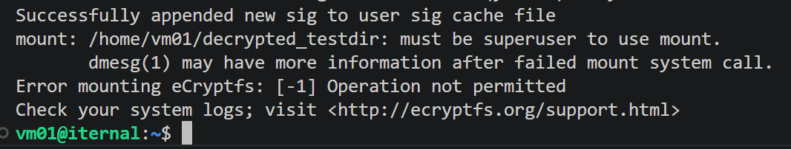

Повторяю всю процедуру монтирования ещё раз, но уже с правами **`root`**.

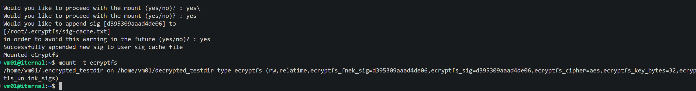

Теперь точка монтирования создана, и можно скопировать какие-нибудь данные в точку монтирования – они будут впоследствии зашифрованы.

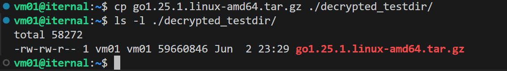

Теперь размонтирую директорию, после чего ещё раз попробую выполнить **`ls`**:

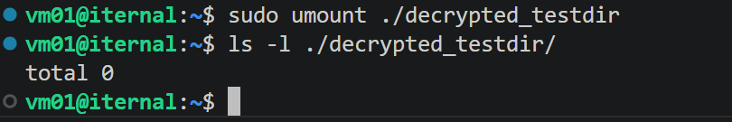

Вижу, что теперь директория пуста. А что же находится в директории, которая была примонтирована – **`.encrypted_testdir`**?

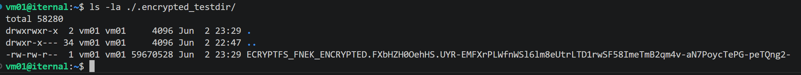

Вижу, что файл есть, но название вместо **`go1.25.1.linux-amd64.tar.gz`** теперь содержит какую-то абракадабру. И теперь любой пользователь, даже **`root`** или злоумышленник, получивший доступ к физическому устройству, увидит именно это и без ключа не сможет расшифровать данные.

Дальше зашифрованную директорию можно также скопировать по сети и примонтировать к любой другой системе, главное – правильно выбрать параметры шифрования, которые были указаны ранее, и, само собой, верно ввести кодовую фразу.

---
---

