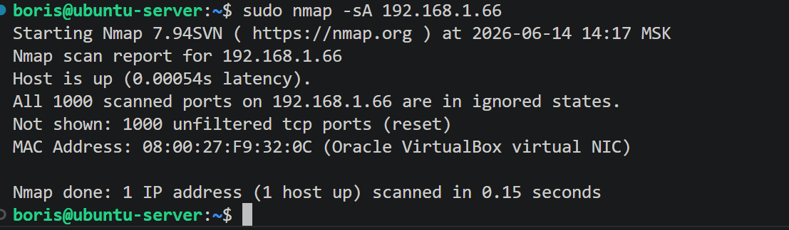
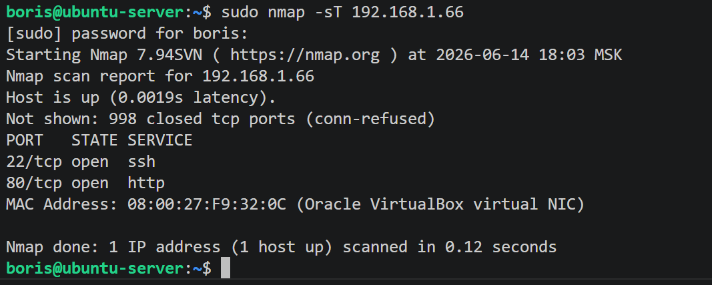
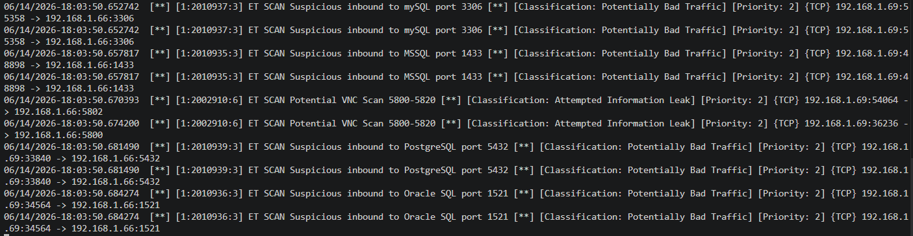
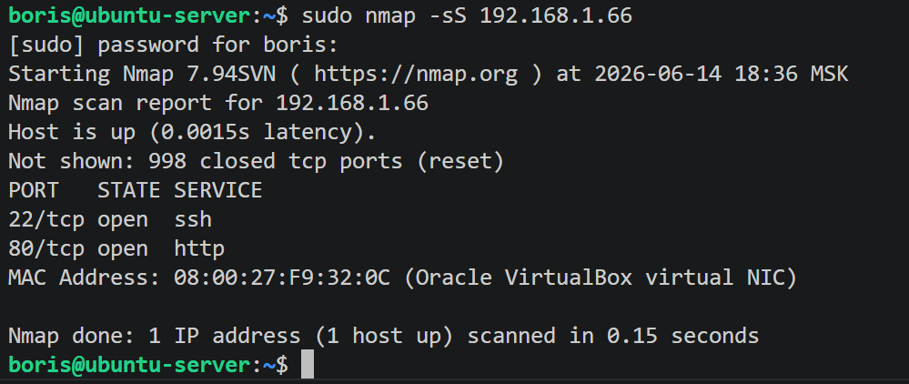
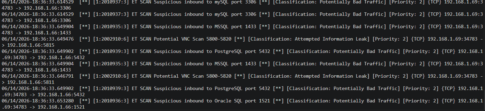
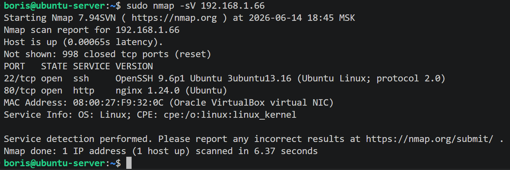
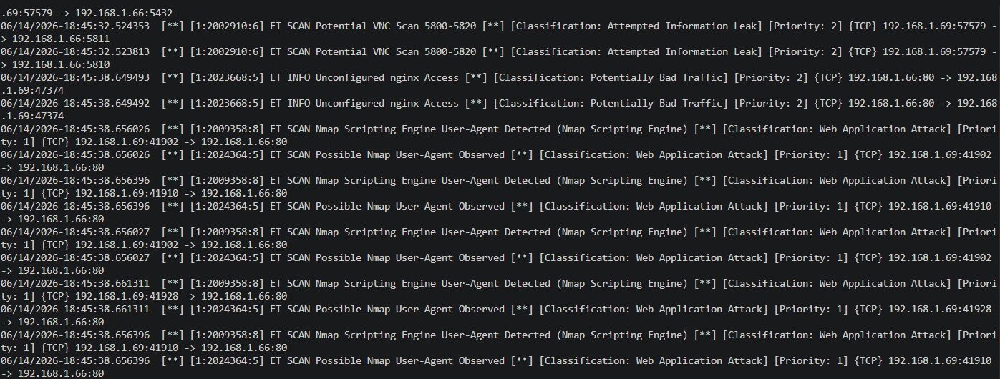
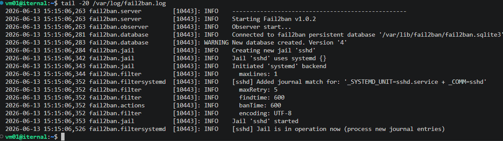

# Домашнее задание к занятию "`Защита сети`" - `Сидоров Борис`

---
---

## Подготовка к выполнению заданий

1. Подготовка защищаемой системы:

- установите **Suricata**,
- установите **Fail2Ban**.

2. Подготовка системы злоумышленника: установите **nmap** и **thc-hydra** либо скачайте и установите **Kali linux**.

Обе системы должны находится в одной подсети.

------

### Задание 1

Проведите разведку системы и определите, какие сетевые службы запущены на защищаемой системе:

**sudo nmap -sA < ip-адрес >**

**sudo nmap -sT < ip-адрес >**

**sudo nmap -sS < ip-адрес >**

**sudo nmap -sV < ip-адрес >**

По желанию можете поэкспериментировать с опциями: https://nmap.org/man/ru/man-briefoptions.html.

*В качестве ответа пришлите события, которые попали в логи Suricata и Fail2Ban, прокомментируйте результат.*

------
## Решение 1
Утилита **fail2ban** очень гибкая в настройках на основе регулярных выражений, но из коробки навряд ли будет реагировать на сканирование сети. **fail2ban** можно сконфигурировать на основе логов сетевого экрана **ufw** или **iptables**.

Пробую начать сканирование через **nmap**, в котором буду посылать в заголовках пакета **ACK** поле:

    sudo nmap -sA 192.168.1.66

В логах я не вижу никакой реакции ни в **fail2ban**, ни в **suricata**.

Далее пробую сканировать с ключом **-sT** – это стандартная попытка установить **TCP**-соединение и получить информацию об открытых портах, то есть будет происходить полноценное **TCP**-соединение:

    sudo nmap -sT 192.168.1.66

Смотрю, что в логах **suricata**:

В этом случае в логах утилиты **suricata** видно, что был зафиксирован нежелательный трафик, и подсвечено, с какого **IP**-адреса и порта была осуществлена попытка подключения. Этот трафик был помечен как нежелательный, так как по данным портам в **suricata** настроены алерты, если будет зафиксирована подозрительная активность.

Сканирую с ключом **-sS** – в этом случае будет инициирована попытка подключения, в пакете будет присутствовать поле **SYN**, а далее после ответа **ACK** последует пакет с полем **RST**, тем самым будет сброшено подключение на самом первом этапе рукопожатия:

    sudo nmap -sS 192.168.1.66

Смотрю логи **suricata**:

На такой тип сканирования **suricata** тоже отреагировала как в предыдущем случае.

Теперь пробую сканирование с ключом **-sV**. В этом режиме сначала будет попытка обычного сканирования портов, как в случае с ключом **-sS**, а затем сканер попробует установить полноценное **TCP**-соединение и подождёт некоторое время – приветственное сообщение от сервиса, а также попробует через заголовок **PSH** принудительно запросить информацию о сервисе:

    sudo nmap -sV 192.168.1.66

Смотрю логи **suricata**:

Тут помимо привычных строк о предупреждении подозрительного трафика также присутствует ещё предупреждение, что используется скриптовый агент **nmap**.

В логах **fail2ban** ничего не было, так как он из коробки не настроен на подобную сетевую активность.

---
---

